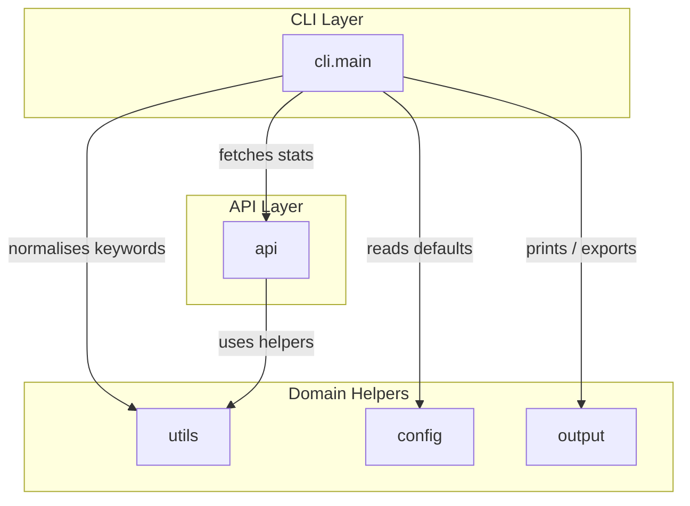

# Documentation Overview

## High-Level Architecture

The project is organised around a thin console script (`yt_ai_toplikes.py`) that forwards to
the reusable `yt_top_likes` package. The CLI coordinates three major concerns:

1. Parse user intent and normalise options (`yt_top_likes.cli`).
2. Retrieve data from the YouTube Data API (`yt_top_likes.api`).
3. Present ranked results on the console or in CSV form (`yt_top_likes.output`).

Shared helpers for keyword preparation and result shaping live in `yt_top_likes.utils`, while
constants and default keywords are centralised in `yt_top_likes.config`.

## Module Responsibilities

- `yt_ai_toplikes.py`: Entry script that exposes `yt_top_likes.cli.main` for direct execution.
- `yt_top_likes.cli`: Argument parsing, API key resolution, mode dispatch, and user feedback.
- `yt_top_likes.api`: Thin HTTP client around the YouTube Data API with error translation.
- `yt_top_likes.output`: Console table renderer and CSV exporter.
- `yt_top_likes.utils`: Keyword filters, numeric coercion, RFC3339 helpers, and chunking.
- `yt_top_likes.config`: API URLs, default keywords, and API-key resolution helper.
- `yt_top_likes.__init__`: Convenience export of `main` for reuse (`python -m yt_top_likes`).

## Directory Layout

```
yt_top_likes/
|-- __init__.py
|-- api.py
|-- cli.py
|-- config.py
|-- output.py
`-- utils.py
```

## Data Flow Diagram



The CLI collects arguments, resolves the API key from the environment or flags, and prepares
the keyword filters. Depending on the chosen mode it invokes either `yt_search`/`yt_videos_stats`
or `fetch_most_liked_videos`. Results flow back through `output.print_top_videos` and
`output.write_csv_output` for presentation.
